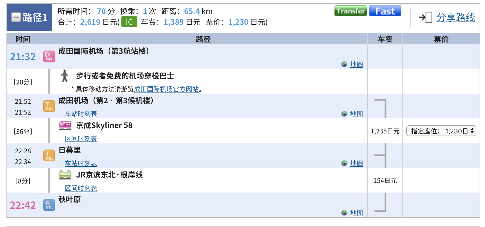
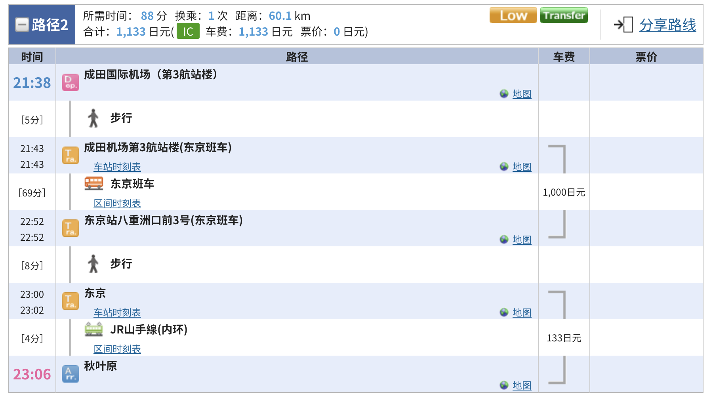
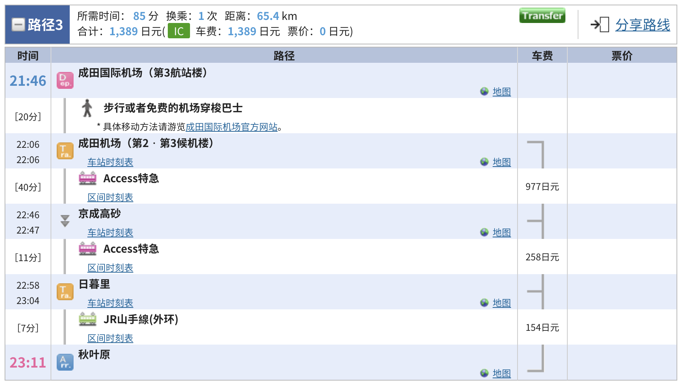
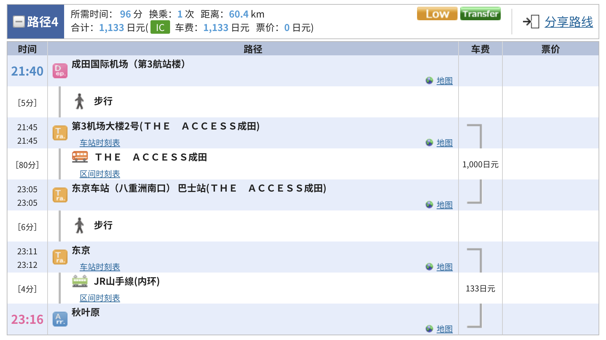
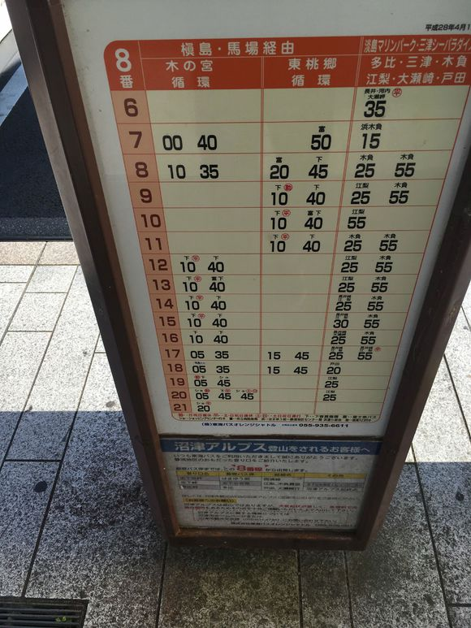

# APP与资料

## 1. Google Map
说起来Google Map的形成规划工具真的是好用。提前规划线路时间必备！
## 2. 东京地铁
东京地铁官方APP。操作简洁，适合东京圈地铁换乘查询
## 3. 换乘案内
配合Google Map，路线规划必备！
## 4. 这个项目guide文件夹内的pdf
基本会收集一些从官方收集来的资料
# 酒店
 
本来想在携程上订酒店，之前安排的时候想订秋叶原华盛顿，但等到要真的下订单了才发现没房间了。。。后面看了一下Agoda（安可达）上的房源还比较靠谱，酒店数量较多，也支持支付宝微信。（看来携程的话还是国内比较有优势）
东京部分的行程最后订了APA神田前，3晚一共4W日元。沼津部分果断订夜羽家，沼津滨江酒店 (Numazu Riverside Hotel)，1晚一共7200日元。比较蛋疼的是夜羽家因为小恶魔太多住不下了，20号晚上就找了沼津大和鲁内酒店 (Daiwa Roynet Hotel Numazu)，1晚一共634HKD。话说这家也是圣地之一哟！

# 交通
* 在每个地铁站都有交通时刻表，上面写着精确的列车到站时间，如有列车延误，东京所有列车上都会通报延误信息（包括地铁，JR，私铁，新干线等）。在日本，铁路公司开具的延误证明书甚至可以作为迟到的理由。东京地铁很准时，因此在东京上班和参加会议一般都坐地铁。（来源百度百科）

* 成田国际机场（Narita Airport），中文官网：http://www.narita-airport.jp/ch1 整座机场拥有三个航站楼，但第三航站楼专供香草航空、捷星航空等廉价航空公司使用。第一，第二，第三航站楼概况及穿梭巴士1号航站楼是最大，3号航站楼最小。航站楼之间有免费穿梭巴士。运营时间：5:00 - 22:30，每7-10分钟一趟，航站楼之间需要5-10分钟车程；2、3航站楼之间也可以步行到达，需要15分钟左右。**强烈建议在 https://www.narita-airport.jp/ch1/step/ 这里看看成田到达入境流程（官方资料，包含了去城区的交通）**，再附上楼层平面图连接 https://www.narita-airport.jp/ch1/map?terminal=3&map=0 

## 成田T3到秋叶原
1. 查了一下成田机场官网，香草航空是T3到达的。预计是20:45分到达，预留1小时buffer。按照21:30分机场出发去秋叶原。实际搭乘线路到时候到达后按照下面的优先级去对应站点乘车就行。

## 从秋叶原到沼津
酒店到东京站：步行（20分钟，1.8km，6点40出发即可）公交线路（12分钟左右，6点50出发即可）

### 方案一
路线：https://goo.gl/maps/YJfaGqjDmgF2
价格: JP¥ 4490，RMB¥ 274
预计到达：9:06

赶 7:56 东京到三岛新干线
赶 9:01 三岛到沼津东海道本线

### 方案二
路线： https://goo.gl/maps/fL1vnP19Uz12
价格：JP¥ 4320，RMB¥ 264
预计到达：9:42
赶 8:26 东京到三岛新干线
赶 9:38 三岛到沼津东海道

## 方案三
JR东海道本线

## 从沼津到内浦
 **8号站台**
### 方案一
路线：https://goo.gl/maps/uEJoiRQqMy62
价格：JP¥ 740， RMB¥ 45
50分钟左右
赶 9:25 沼津到江梨 Bus

### 方案二
路线：https://goo.gl/maps/7Pbws9gJM2w
价格：JP¥ 740， RMB¥ 45
50分钟左右
赶 9:55 沼津到木负农 Bus

**如果9点55还没上车的话，只能等10点55了，这个时间可以在沼津先把景点看完**

## 内浦回沼津
路线：https://goo.gl/maps/WmDsnjYzfZS2
价格：JPY¥ 740， RMB¥ 45
50分钟左右
赶 5:56 木负农到沼津 Bus

后一班 6:53
前一班 5:26

## 沼津到成田
预计2.5小时，行程待定

# 景点
沼津，东京相关的圣地已经在 Google Map 的地点共享中标出：

https://goo.gl/maps/PBGoHV6wE1k

关于路线和时间规划，在前一天用google map的时间规划工具排好即可。

# 注意事项
## 机场相关
* 机场可以先给suica喂个3000 JP¥。

## 乘车相关
* 在沼津，橙色JR公交（包括痛车）前门上车；墨绿色伊豆后门上车。
* 沼津不能用suica，提前换好10元零钱
* 乘坐新干线方法：进站放两张票进去，出来也是，如果有问题去【駅員室】
乘坐JR先买票：可以花500买一个IC卡方便，这些都能在自动售票机上操作，JR要看好方向了，很容易做错
乘坐巴士方法：沼津市内巴士不支持IC卡，准备好零钱（2000到3000）上车拿左手边【整理券】保留好，看好显示屏的数字，那就是你要付的钱，或者看乘换案内给的票价，提前准备好，下车券钱一起扔到箱子里就好（参考：https://tieba.baidu.com/p/4691008974?red_tag=2309015034）
9
* 站牌读法：https://zhidao.baidu.com/question/2141253588536127068.html 第一列是时，后面的是分。

# 出发前Checklist
- [ ] **护照，证件**
- [ ] **票券**
- [ ] 航空公司托运，随身行李规则
- [ ] 当地天气
- [ ] 打印酒店预定单
- [ ] 打印机票出行单
- [ ] 机场到达，出发航站楼